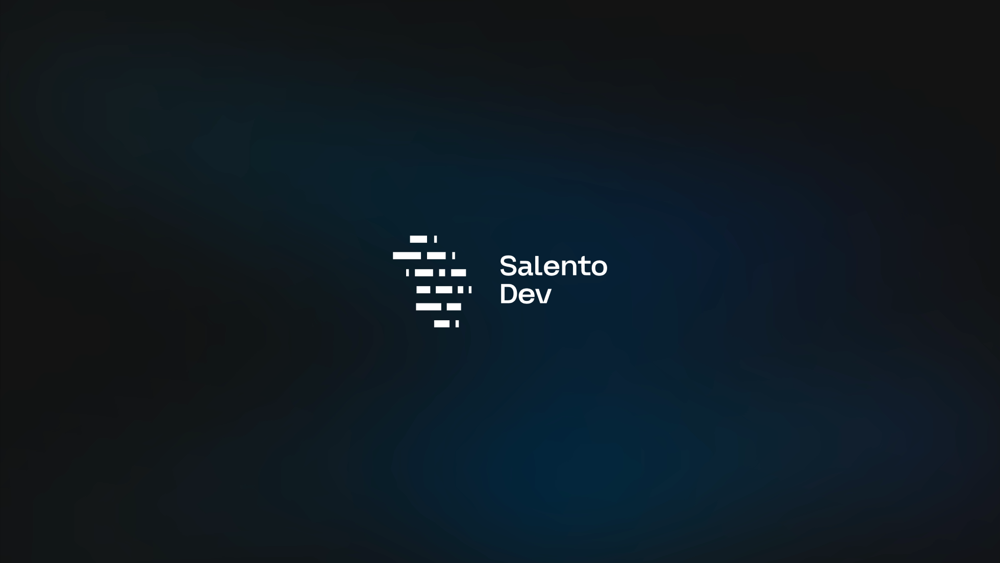

# Salento Dev - Talks

> Raccolta dei talk presentati dalla community [Salento Dev](https://salento.dev)

## Chi siamo

**Salento Dev** è una community di sviluppatori del Salento che alterna momenti strutturati di formazione, spazi aperti per confrontarsi e occasioni informali per fare rete.

### Cosa facciamo

- 🎤 **Meetup e workshop**: incontri tecnici periodici, live coding, talk, panel e Q&A
- 🍹 **AperiDev**: appuntamenti informali per fare networking
- 🧭 **Mentorship**: orientamento per nuovi sviluppatori
- 🗺️ **Rotazione territoriale**: eventi distribuiti in tutto il Salento

---

## Talk

### 2025/11/13 - Presentazione di Salento Dev

Il primo meetup della community: chi siamo, cosa facciamo e perché nasciamo.

---

## Partecipa

Vuoi unirti alla community? Visita [salento.dev](https://salento.dev) e seguici sui nostri canali social per rimanere aggiornato sui prossimi eventi e iniziative.
